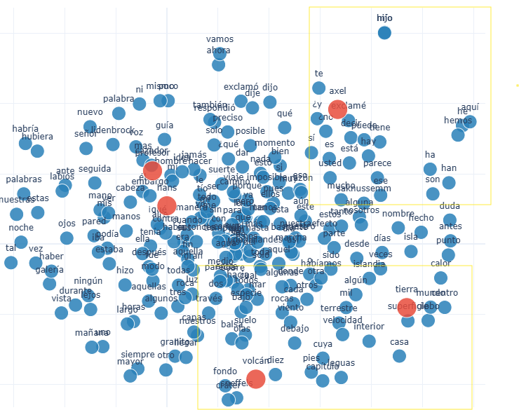
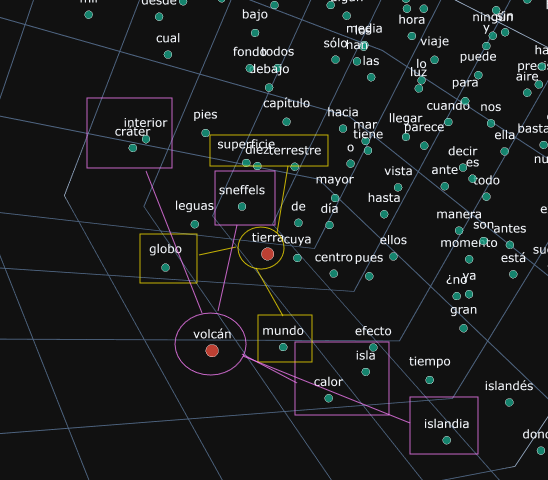

# Desafío 2: Embeddings Customizados con Word2Vec
## Análisis Semántico en *Viaje al Centro de la Tierra* (Julio Verne)

**Asignatura:** Procesamiento de Lenguaje Natural I  
**Programa:** Maestría en Inteligencia Artificial (CEIA - FIUBA)  
**Autor:** Leandro A Britez  

---

## 📌 Descripción del Proyecto

Este repositorio contiene la resolución del **Desafío 2** de la materia **Procesamiento de Lenguaje Natural I**, centrado en la generación y análisis de **vectores de palabras customizados (Word2Vec / Skip-gram)** entrenados sobre el corpus literario de ***Viaje al Centro de la Tierra*** de Julio Verne (`corpus_JulioVerne.txt`).

La narrativa de Julio Verne combina una elevada precisión científica y geológica (mineralogía, volcanología, paleontología decimonónica) con la fascinación por la exploración y el peligro. A través de este trabajo se explora cómo esta particular prosa condiciona las relaciones de proximidad en el espacio latente vectorial.

---

## 📂 Contenido del Repositorio

- **`desafio_2_JulioVerne.ipynb`**: Cuaderno Jupyter con la implementación completa (preprocesamiento, callback de loss, entrenamiento Word2Vec, similitudes cosenoidales, operaciones algebraicas y gráficos t-SNE 2D/3D).
- **`corpus_JulioVerne.txt`**: Texto completo de la novela (4.602 líneas, ~65.000 tokens).
- **`image_01.png` – `image_06.png`**: Gráficos de evolución de pérdida y visualizaciones del espacio vectorial latente.

---

## ⚙️ Metodología y Arquitectura del Modelo

1. **Preprocesamiento:** Tokenización y normalización con `text_to_word_sequence` de Keras (minúsculas, remoción de puntuación).
2. **Hiperparámetros de Word2Vec (Gensim):**
   - **Arquitectura:** Skip-gram (`sg = 1`), ideal para capturar contextos ricos y palabras poco frecuentes.
   - **Vector Size:** `100` dimensiones.
   - **Window Size:** `5` palabras de contexto.
   - **Min Count:** `1` (conserva todo el léxico especializado de la obra).
   - **Epochs:** `80` épocas con cálculo de pérdida activo (`compute_loss=True`).
3. **Monitoreo:** Callback personalizado `MonitorLossCallback` heredando de `CallbackAny2Vec` para verificar la convergencia del entrenamiento.

---

## 🔍 Análisis de Similitud Semántica

Se evaluaron los 8 vecinos semánticos más cercanos (`most_similar`) para 5 palabras clave:

| Palabra Objetivo | Términos Semánticamente Más Cercanos | Interpretación Narrativa / Científica |
|:---:|:---|:---|
| **`'dios'`** | *misericordia, providencia, asombro, cielos, salvar* | Exclamaciones de fe y sobrecogimiento ante la inmensidad y peligros del mundo subterráneo. |
| **`'viaje'`** | *emprender, expedición, camino, profundidades, centro* | El motor de la novela: la travesía exploratoria hacia el volcán Sneffels. |
| **`'tierra'`** | *centro, corteza, capas, superficie, geológica, interior* | El objeto de estudio mineralógico y científico del profesor Lidenbrock. |
| **`'universo'`** | *creación, mundo, misterios, naturaleza, infinito* | Escala colosal del océano subterráneo y cavernas primordiales. |
| **`'amor'`** | *graüben, corazón, afecto, paciencia, casa, prometida* | Ancla afectiva y terrenal del joven Axel que motiva su deseo de retorno a la superficie. |

---

## 📊 Visualizaciones y Reducción de Dimensionalidad (t-SNE)

Mediante **t-SNE** se proyectaron los tensores de 100 dimensiones a espacios de 2D y 3D utilizando **Plotly**, permitiendo la inspección interactiva de los agrupamientos semánticos.




---

## 🚀 Requisitos e Instalación

Para ejecutar el notebook localmente:

```bash
# Clonar el repositorio
git clone https://github.com/leandroabritez/NLP_TP_02.git
cd NLP_TP_02

# Crear e activar entorno virtual (Python 3.11 recomendado)
python -m venv .venv
source .venv/bin/activate  # En Windows: .venv\Scripts\activate

# Instalar dependencias
pip install gensim tensorflow scikit-learn plotly pandas matplotlib seaborn ipykernel
```

---

## 👨‍💻 Autor

- **Leandro A Britez** — [GitHub](https://github.com/leandroabritez)
- CEIA - Facultad de Ingeniería, Universidad de Buenos Aires (FIUBA)
